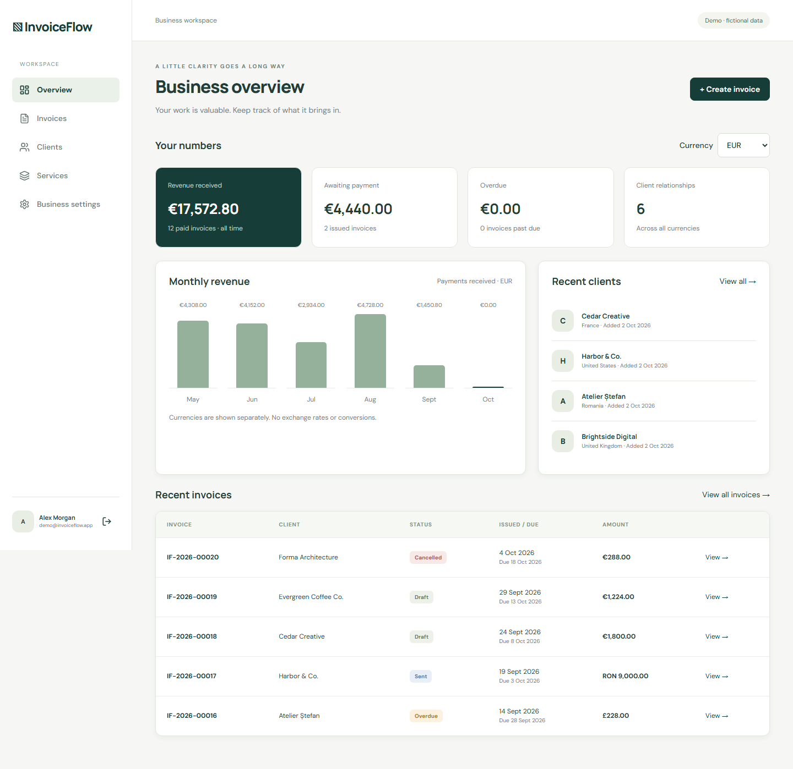
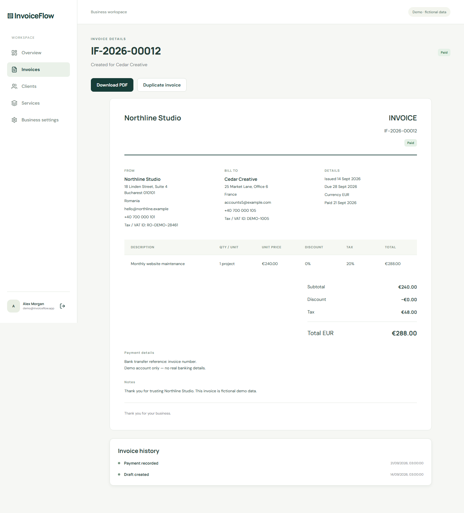

# InvoiceFlow

A complete freelancer business workspace for clients, reusable services, invoices, and payment tracking. Built as a professional full-stack portfolio project with React, TypeScript, Express, PostgreSQL, and Prisma.

## Explore

Use **Explore the demo workspace** on the sign-in screen, or sign in with `demo@invoiceflow.app` / `InvoiceFlowDemo!2026`. All sample companies, contact information, invoices, and payment instructions are fictional. The shared demo is editable; create a private account for your own data.

Deployment details and verified URLs are maintained in [PUBLIC_DEPLOYMENT.md](docs/PUBLIC_DEPLOYMENT.md).

## Screenshots




[Mobile overview](docs/screenshots/mobile-dashboard.png) · [Invoice editor](docs/screenshots/invoice-editor.png) · [Clients](docs/screenshots/clients.png) · [Services](docs/screenshots/services.png) · [Invoices](docs/screenshots/invoices.png) · [Settings](docs/screenshots/settings.png)

The screenshots show the running application with fictional seed data, not design mockups.

## Features

- Registration, login, persistent cookie sessions, logout, and password-confirmed account deletion.
- Private client records for companies and individuals, including addresses, tax identifiers, and notes.
- Currency-specific reusable service presets with units, prices, and tax rates.
- Draft invoice creation and editing, immutable issued invoices, duplication, manual sent/paid/cancelled transitions, and automatic overdue classification.
- Professional Unicode PDF generation with embedded open-source fonts, multipage support, and ownership checks.
- EUR, RON, USD, and GBP; per-currency revenue, unpaid balances, overdue invoices, monthly payments, and recent clients.
- Search, client/status/currency/date filtering, CSV exports, and invoice event history.
- Responsive desktop, tablet, and mobile layouts with loading, validation, error, confirmation, and empty states.

## Technology

React 19, TypeScript, Vite, React Router, custom responsive CSS, Lucide icons, Node.js, Express 5, Prisma 6, PostgreSQL, Zod, bcrypt, decimal.js, PDFKit, Vitest, Supertest, Playwright, GitHub Actions, and Docker support. Node 22 LTS is recommended; Node 24 is supported. Dependencies are locked with pnpm.

## Architecture

```text
src/                    React UI, pages, reusable components, data/auth hooks
shared/                 Validation, types, decimal calculation contract
server/routes/          Auth and ownership-scoped REST endpoints
server/services/        Invoice transactions, numbering, snapshots, PDFs
prisma/                 PostgreSQL schema, migration, fictional idempotent seed
assets/fonts/           Licensed Noto Sans PDF fonts
scripts/                Local PostgreSQL, Desktop supervisor, Vercel configuration
 tests/                 Unit/API tests and desktop/mobile browser workflows
 docs/                  API, calculation, privacy, deployment, verification, screenshots
```

The browser previews calculations using the shared domain function. The API independently validates input and recomputes every monetary value. Prisma stores exact decimals; values travel over JSON as strings. A user owns a profile, clients, services, sessions, and invoices. Invoice lines and events belong to their invoice. Seller/client snapshots preserve issued document history even when live records change. User-row locks serialize invoice numbering and updates; revision checks reject stale writes.

## Installation and database

```sh
corepack enable
corepack prepare pnpm@11.19.0 --activate
pnpm install --frozen-lockfile
cp .env.example .env
pnpm db:generate
```

On PowerShell use `Copy-Item .env.example .env`. Either supply a PostgreSQL connection in `.env`, or run `pnpm dev:db` in a separate terminal for an isolated local PostgreSQL instance on port **54331**. Keep that terminal open.

```sh
pnpm db:migrate
pnpm db:seed
pnpm dev
```

Open `http://127.0.0.1:5175`; the API is `http://127.0.0.1:4002`. The Desktop launcher uses the same dedicated ports. Do not start both development mode and the Desktop launcher at once. The seed creates the demo only if it does not exist and never overwrites account changes.

## Environment

| Variable          | Purpose                                                          |
| ----------------- | ---------------------------------------------------------------- |
| `DATABASE_URL`    | Private PostgreSQL connection; local default in `.env.example`   |
| `PORT`            | API listener; default 4002                                       |
| `APP_ORIGIN`      | Exact allowed frontend origin                                    |
| `NODE_ENV`        | `production` enables secure cookies and required mutation Origin |
| `SERVE_WEB`       | `true` serves the built frontend from Express, useful for Docker |
| `ALLOW_DEMO_SEED` | Explicitly `true` permits production fictional seeding           |
| `PUBLIC_DEMO_URL` | HTTPS target for public browser verification                     |

No database credentials, local data, session tokens, or production secrets are committed. The frontend uses same-origin `/api`; deployment rewrites forward it to the backend.

## Calculation model

For each line, quantity × unit price is rounded half up to two decimals. Percentage discount is rounded and subtracted, then tax is computed on that net amount and rounded. Invoice totals are sums of those rounded line values. No floating-point arithmetic is used for persisted monetary calculations. Quantities allow three decimal places; prices, discounts, and tax rates allow two. [Full model and examples](docs/CALCULATION_MODEL.md).

Currencies are independent units of account. Selecting a currency does not convert prices. Revenue means recorded paid invoice totals, including tax, grouped by payment date; it is not net profit or recognized accounting revenue.

## Testing

Use a disposable PostgreSQL database: API tests create and remove their own accounts and must never target real customer data.

```sh
pnpm build
pnpm test
pnpm exec playwright install chromium
pnpm test:e2e
```

The suite contains unit tests for exact calculations and validation, API integration tests for authorization and invoice behavior, plus six browser workflows run on desktop and mobile. PDF extraction executes in a separate process to isolate the parser. Public browser tests use temporary private accounts and delete them afterwards:

```sh
PUBLIC_DEMO_URL=https://your-deployment.example pnpm test:e2e:public
```

On PowerShell set `$env:PUBLIC_DEMO_URL` first. [Verification evidence](docs/VERIFICATION.md) records actual results and limitations. GitHub Actions starts PostgreSQL 16 and runs generation, migration, seeding, build, unit/API tests, and browser tests.

## Deployment

Recommended: Vercel frontend, free Render API, free Neon PostgreSQL. [Deployment guide](docs/DEPLOYMENT.md) explains configuration, migrations, seeding, secure cookies, same-origin routing, and cold starts. `render.yaml` provides the backend configuration. Run `node scripts/configure-vercel.mjs https://your-api.onrender.com` to generate the correct frontend rewrite.

Docker builds a single API/web image with embedded fonts. Set a URL-safe `POSTGRES_PASSWORD`, then `docker compose up --build`. Open `http://localhost:4002`; seed explicitly using the built seed with `ALLOW_DEMO_SEED=true`. Docker execution depends on a Docker installation; do not treat configuration alone as runtime verification.

## Decisions and limits

- Manual delivery is explicit: downloading a PDF and marking it sent does not send email. Marking paid records an external payment; it does not charge anyone.
- Paid and cancelled invoices are terminal. Unpaid issued invoices can be cancelled; only drafts can be edited or deleted. Corrections to paid invoices need a future credit-note workflow.
- Numbering is user-scoped and monotonic, with issue year included in the prefix. It is not reset each year, and deleted numbers are never reused.
- Overdue is derived from UTC calendar dates. Invoice contents are locked once sent; UTC is the documented business-date boundary.
- A client deletion retains historic snapshots. Account deletion removes application records; managed-provider backups follow their own retention policies.
- This is a portfolio product, not a jurisdiction-certified invoicing/tax filing system. No e-Factura submission, statutory tax determination, credit notes, email delivery, exchange rates, bank synchronization, subscriptions, or payment processor.
- Single owner per workspace; no teams or organization roles. Demo limits: 200 clients, 100 presets, 500 invoices, 100 lines/invoice. Lists load the bounded workspace rather than server pagination.
- Auth uses seven-day database sessions with SHA-256 token digests, HttpOnly cookies, bcrypt cost 12, rate limits, and origin verification. Password reset, email verification, MFA, distributed rate limiting, and scheduled expired-session cleanup are future production work.

Future development: credit notes, invoice email delivery with audit trails, configurable numbering/tax templates, recurring invoices, reminders, team roles, pagination, and observability.

## Portfolio provenance

Developed with Codex assistance. The proven authentication, local-runtime, and deployment scaffold was adapted from the earlier CareerLens AI portfolio project; the invoicing domain, calculations, database model, PDFs, UI, and tests were built for InvoiceFlow. [Case study](PORTFOLIO_CASE_STUDY.md) describes concrete decisions and learning topics without claiming independent authorship or unmeasured business outcomes.

References: [decimal.js documentation](https://mikemcl.github.io/decimal.js/), [PDFKit documentation](https://pdfkit.org/docs/getting_started.html). PDF fonts are Noto Sans under the included SIL Open Font License. Application source is MIT licensed.
